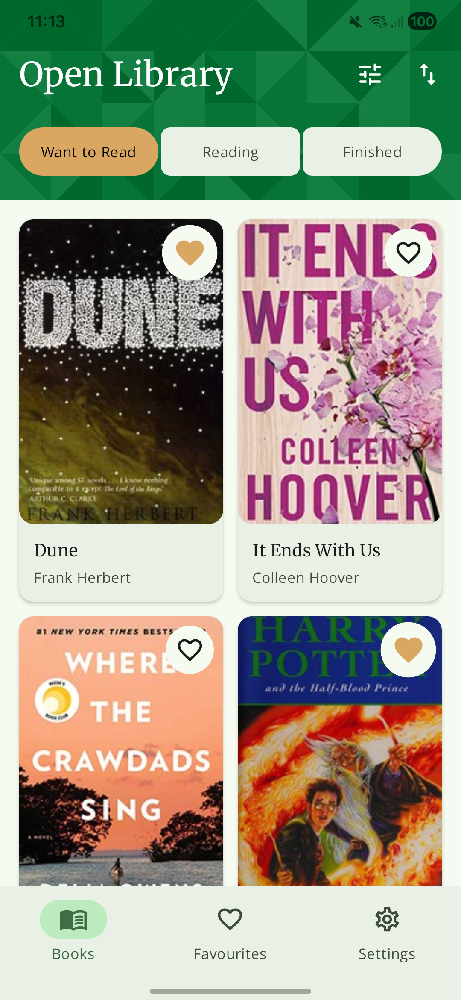
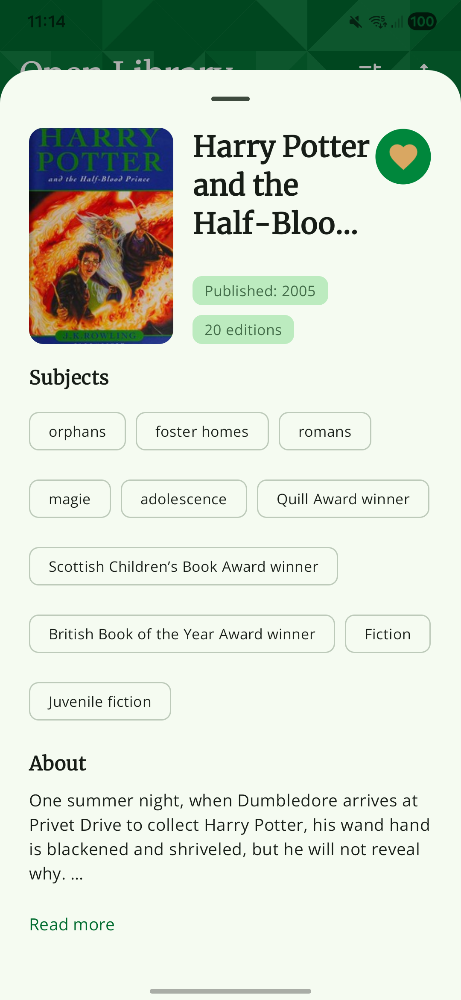
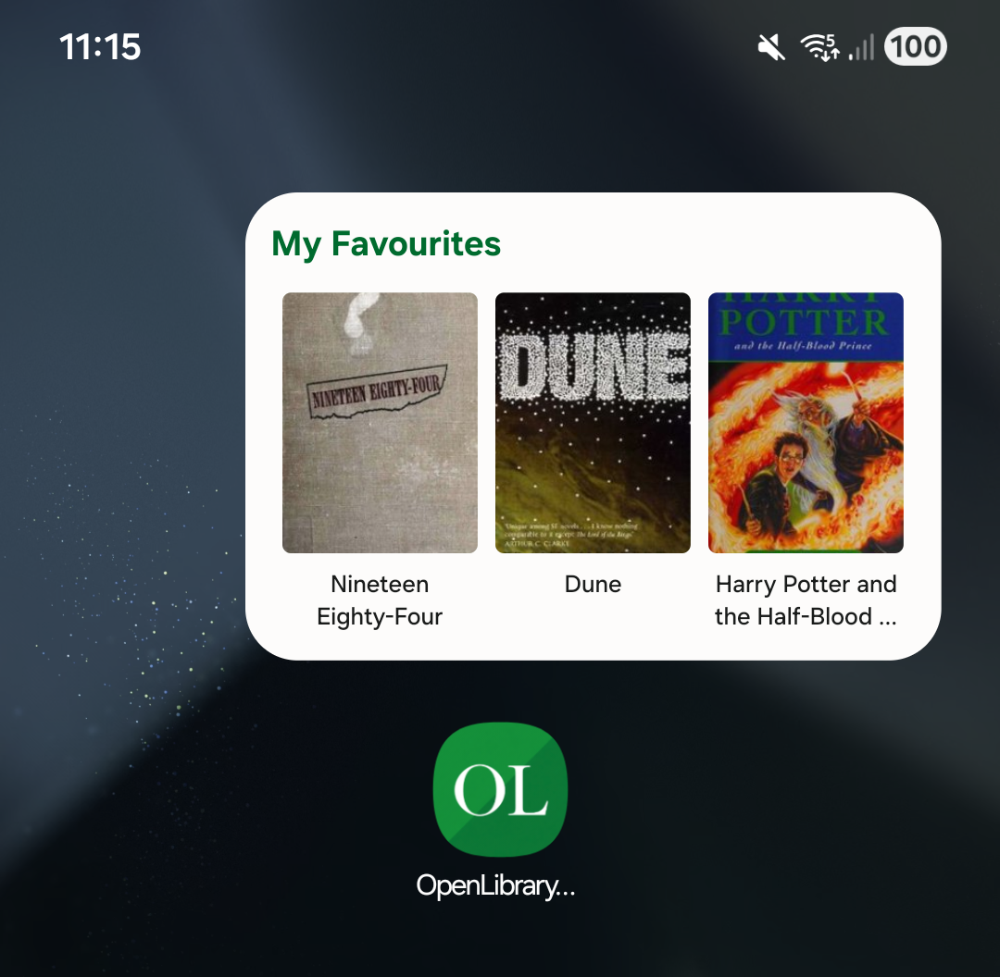
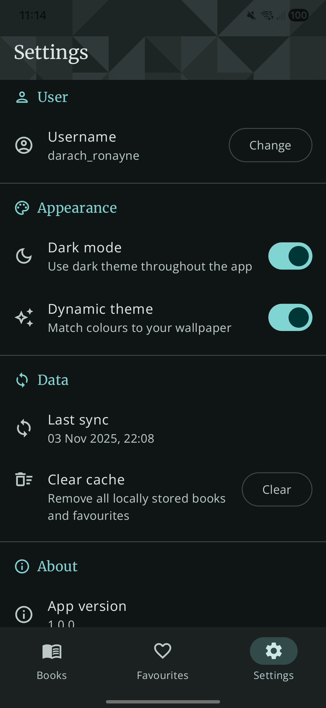
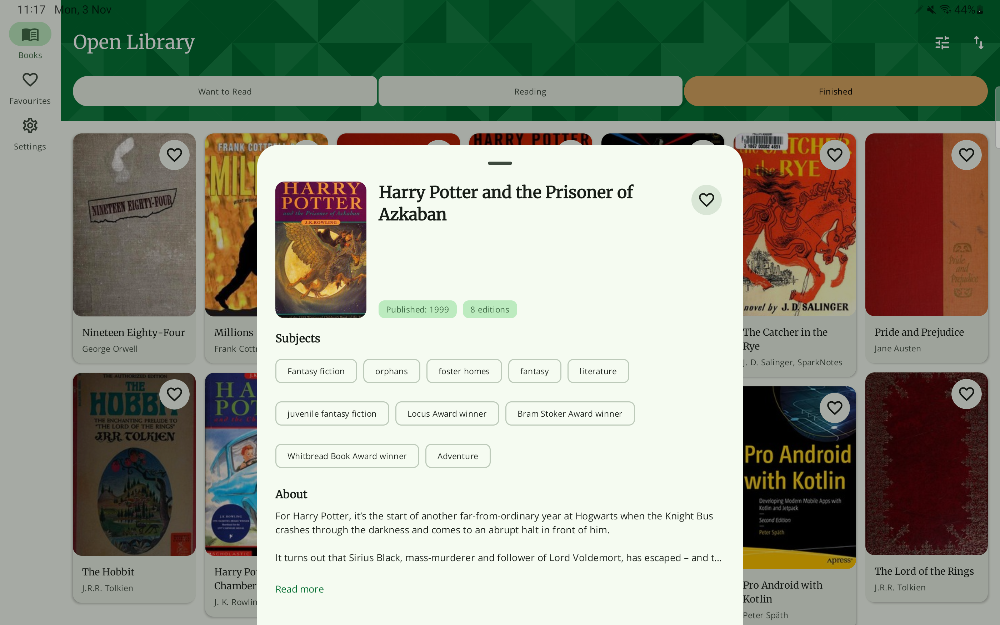
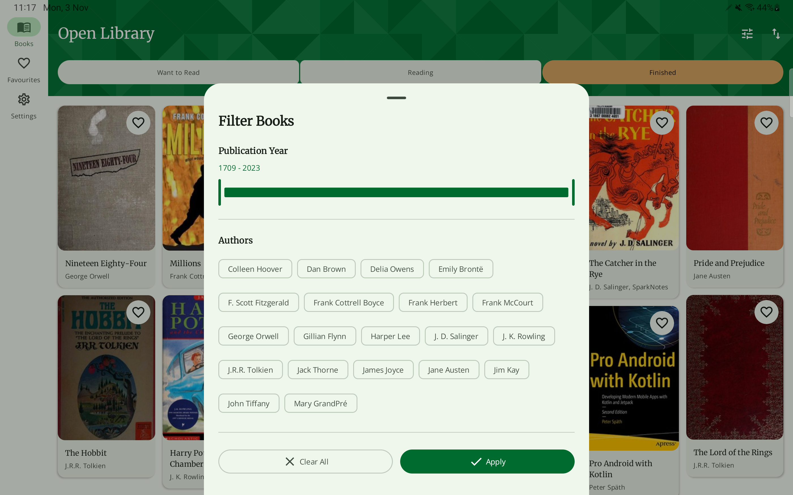
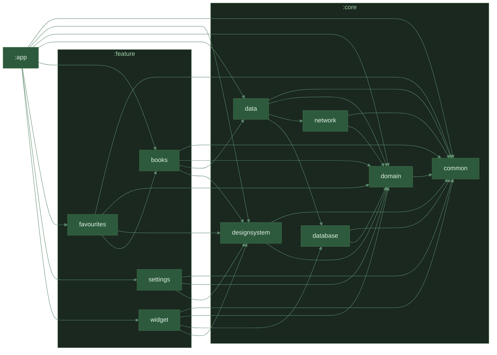

<div align="center">

</div>

---

## About

An Android app demonstrating MVVM architecture and reactive programming best practices. Features reading lists from Open Library's API with offline-first browsing, filtering, sorting, favourites management, and a home screen widget. Built with a focus on state handling, reactive data flows, and architectural patterns.

**Demonstrates:** MVVM architecture, RxJava reactive streams, multi-module design, offline-first repository pattern, and Material 3 adaptive layouts

---

## Key Features

**User Experience**

- Offline-first reading list browsing with Room caching and 6-hour background sync
- Personal reading lists (Want to Read, Currently Reading, Already Read)
- Multi-criteria filtering and flexible sorting options
- Favourites management with local persistence
- Home screen widget displaying 3 most recent favourite books
- Material 3 dynamic theming with dark mode support
- Adaptive layouts for phones and tablets

**Technical Highlights**

- **MVVM architecture** with clear separation of concerns and unidirectional data flow
- **RxJava 3** for reactive data streams and composition
- **Offline-first** with Room database and Retrofit repository pattern
- **State handling**: Robust loading, success, and error states throughout the app
- **Background sync** with WorkManager and RxJava integration
- **Dependency injection** with Hilt for testability
- **Firebase** Performance, Analytics, and Crashlytics integration
- **Code quality**: Detekt, Spotless, and Kover coverage tracking

---

## Screenshots

<div align="center">
<table>
<tr>
<td><br/><strong>Reading Lists</strong></td>
<td><br/><strong>Book Details</strong></td>
<td><br/><strong>Favourites</strong></td>
<td><br/><strong>Home Widget</strong></td>
<td><br/><strong>Settings</strong></td>
</tr>
</table>
</div>

### Tablet Layout

<div align="center">
<table>
<tr>
<td><br/><strong>Adaptive Grid</strong></td>
<td><br/><strong>Details View</strong></td>
</tr>
<tr>
<td colspan="2"><br/><strong>Filters & Sorting</strong></td>
</tr>
</table>
</div>

---

## Architecture

**MVVM + Clean Architecture** with reactive programming:

```
UI (Composables) → Events
  ↓
ViewModel (StateFlow + RxJava)
  ↓
UseCases (Domain Logic)
  ↓
Repository (RxJava Streams)
  ↓
Room ⟷ Retrofit
```

**State Management Flow:**
- **Loading States**: Skeleton screens during data fetches
- **Success States**: Rendered content with proper error boundaries
- **Error States**: User-friendly error messages with retry actions
- **Reactive Updates**: RxJava observables propagate changes throughout the stack

**Tech Stack**

- **Kotlin 2** with RxJava 3, Flow, sealed classes
- **RxJava 3** - Reactive programming with Singles, Observables, and operators
- **Jetpack Compose** - Declarative UI with zero XML
- **Room** - Offline-first reactive queries with RxJava support
- **Retrofit 3** + **OkHttp** - Type-safe API client with RxJava adapters
- **Hilt** - Compile-time dependency injection
- **WorkManager** - Background sync with RxJava3 workers
- **Firebase** - Analytics, Crashlytics, Performance monitoring
- **Coil** - Image loading with Compose integration

**Testing & Quality**

- **21 test files**: Unit tests, repository tests, and ViewModel tests
- **Detekt** - Static analysis for code quality
- **Spotless** + ktlint - Consistent formatting
- **Kover** - Code coverage tracking
- **Mockk, Truth** - Test utilities for mocking and assertions

---

## Module Structure

```
app/                    # Application entry, navigation, WorkManager sync
feature/                # Feature modules (presentation layer)
  ├── books/            # Reading lists, filter, sort
  ├── favourites/       # Favourites management
  ├── settings/         # App preferences (username, theme)
  └── widget/           # Home screen widget
core/                   # Shared modules
  ├── domain/           # UseCases, repository interfaces
  ├── data/             # Repository implementations
  ├── database/         # Room DAOs and entities
  ├── network/          # Retrofit API services
  ├── designsystem/     # Shared composables, theme
  └── common/           # Utilities and extensions
```

**Why multi-module?**

- Clear architectural boundaries enforce MVVM separation
- Feature isolation improves testability
- Parallel builds reduce compilation time
- Domain layer remains framework-agnostic
- Repository pattern isolates data sources

---

## Module Graph



---

## Reactive Data Flow

The app leverages RxJava throughout the stack for reactive, composable data operations:

**Repository Layer (RxJava)**
```kotlin
// RxJava Single for one-time operations
fun getBooks(shelf: String): Single<List<Book>>

// Observable for reactive database queries
fun observeFavouriteBooks(): Observable<List<Book>>
```

**ViewModel Layer (RxJava → Flow)**
```kotlin
// Convert RxJava streams to StateFlow for Compose
booksRepository.observeFavouriteBooks()
    .map { books -> BooksState.Success(books) }
    .toFlowable()
    .toFlow()
    .stateIn(viewModelScope, SharingStarted.Lazily, BooksState.Loading)
```

**Background Sync (WorkManager + RxJava)**
```kotlin
// RxWorker for background sync
class SyncWorker : RxWorker() {
    override fun createWork(): Single<Result> {
        return booksRepository.syncBooks()
            .map { Result.success() }
            .onErrorReturn { Result.retry() }
    }
}
```

---

## State Handling

Robust state management across all features:

```kotlin
sealed interface BooksState {
    data object Loading : BooksState
    data class Success(val books: List<Book>) : BooksState
    data class Error(val message: String) : BooksState
}
```

- **Loading**: Skeleton screens provide immediate visual feedback
- **Success**: Data rendered with pull-to-refresh support
- **Error**: User-friendly messages with retry actions
- **Reactive**: State updates propagate via StateFlow to UI

---

## Testing

```bash
./gradlew test                    # All unit tests
./gradlew koverHtmlReport         # Coverage report
./gradlew detekt                  # Static analysis
./gradlew spotlessApply           # Format code
```

**Coverage:** Kover configured with exclusions for generated code (Hilt, Room, Compose)

**Test Coverage Includes:**
- Repository layer tests with mocked data sources
- ViewModel state transition tests
- UseCase business logic tests
- RxJava stream transformation tests

---

## Getting Started

1. Clone the repository
2. Add your Open Library username to `local.properties`:
   ```
   DEFAULT_USERNAME=your_username
   ```
3. Build and run the app
4. The app will sync your reading lists and enable offline browsing

**Background Sync:**
- Automatic sync every 6 hours via WorkManager
- Manual refresh with pull-to-refresh gesture
- All data cached locally for offline access

---

## Developer

**Darach Ronayne** | Senior Android Developer @ LUSH

[LinkedIn](https://www.linkedin.com/in/darachronayne/) | [GitHub](https://github.com/DRonayne) | [Email](mailto:darachronayne@gmail.com)

---
